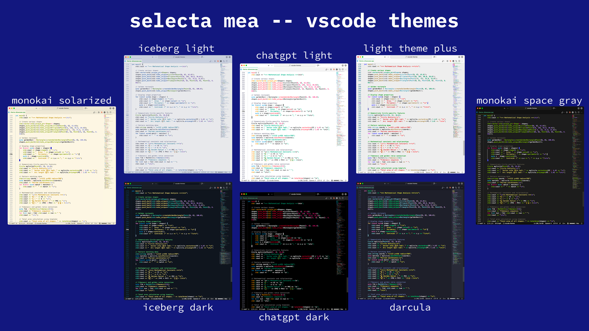
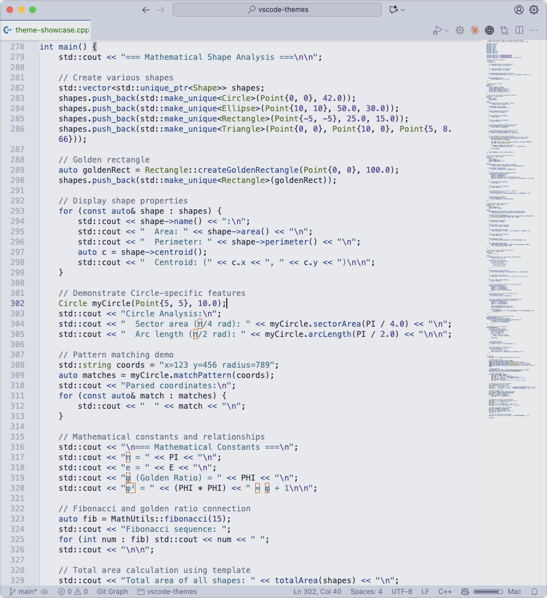
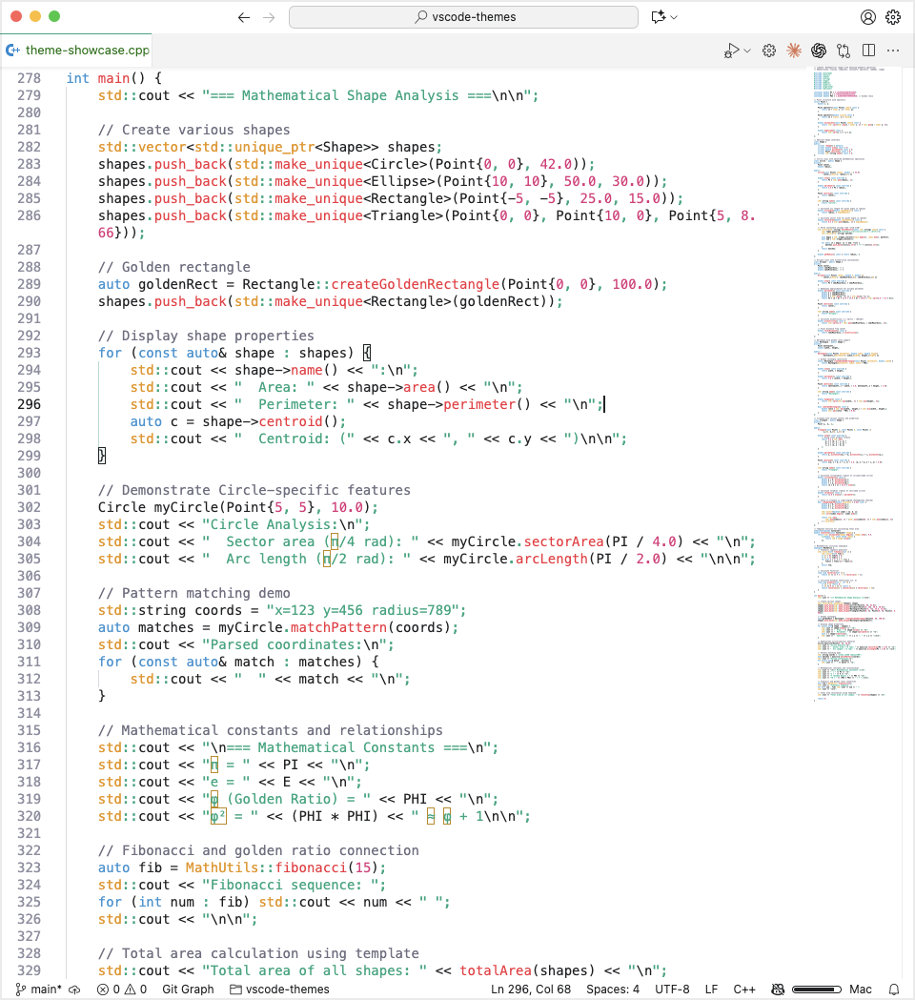
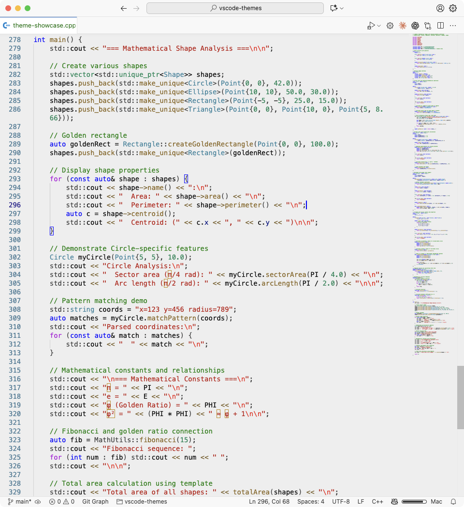
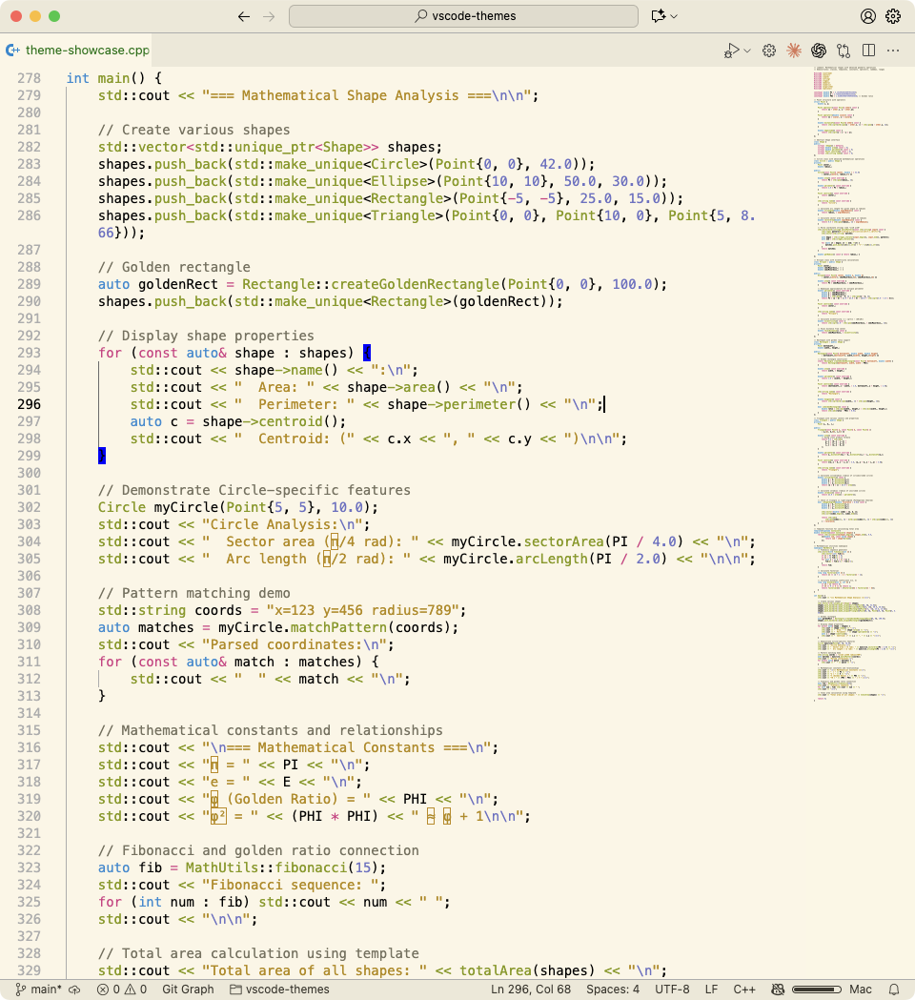
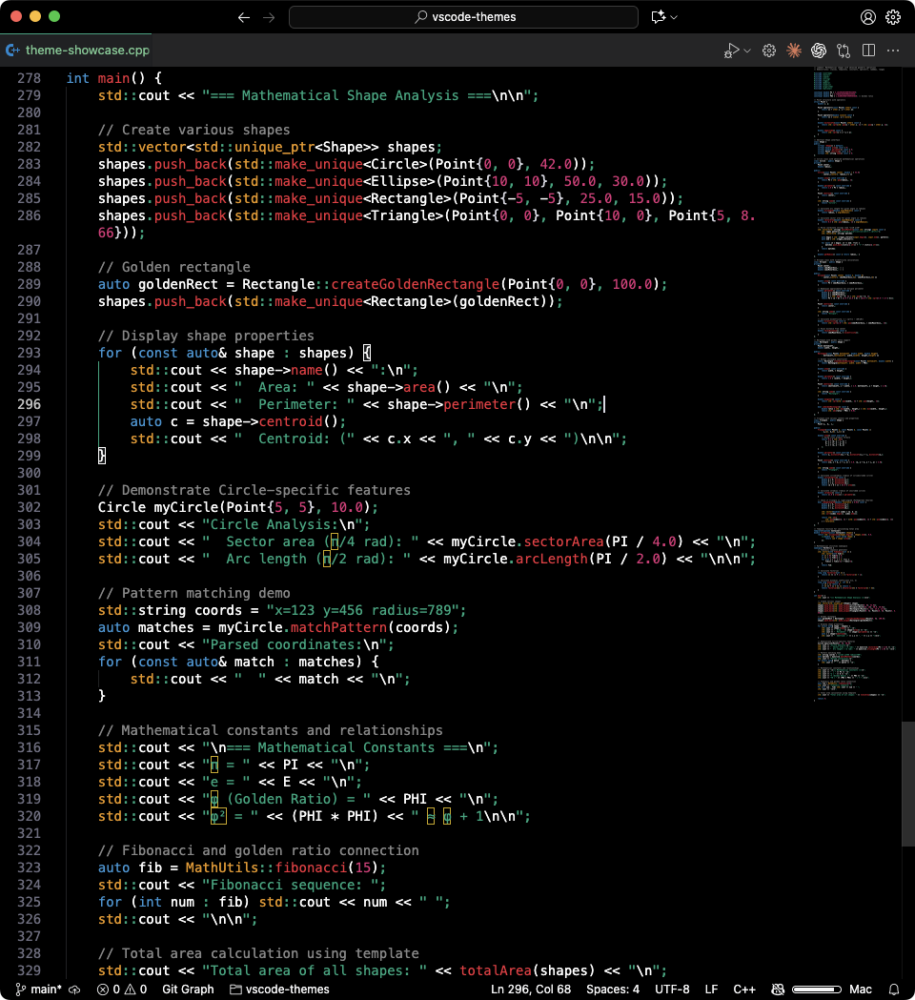
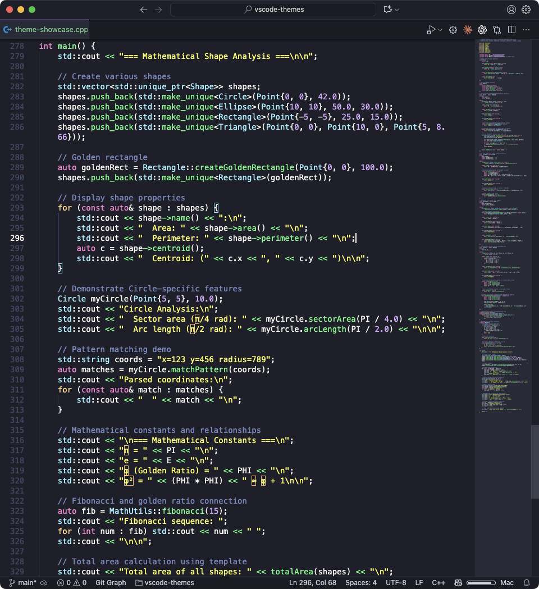
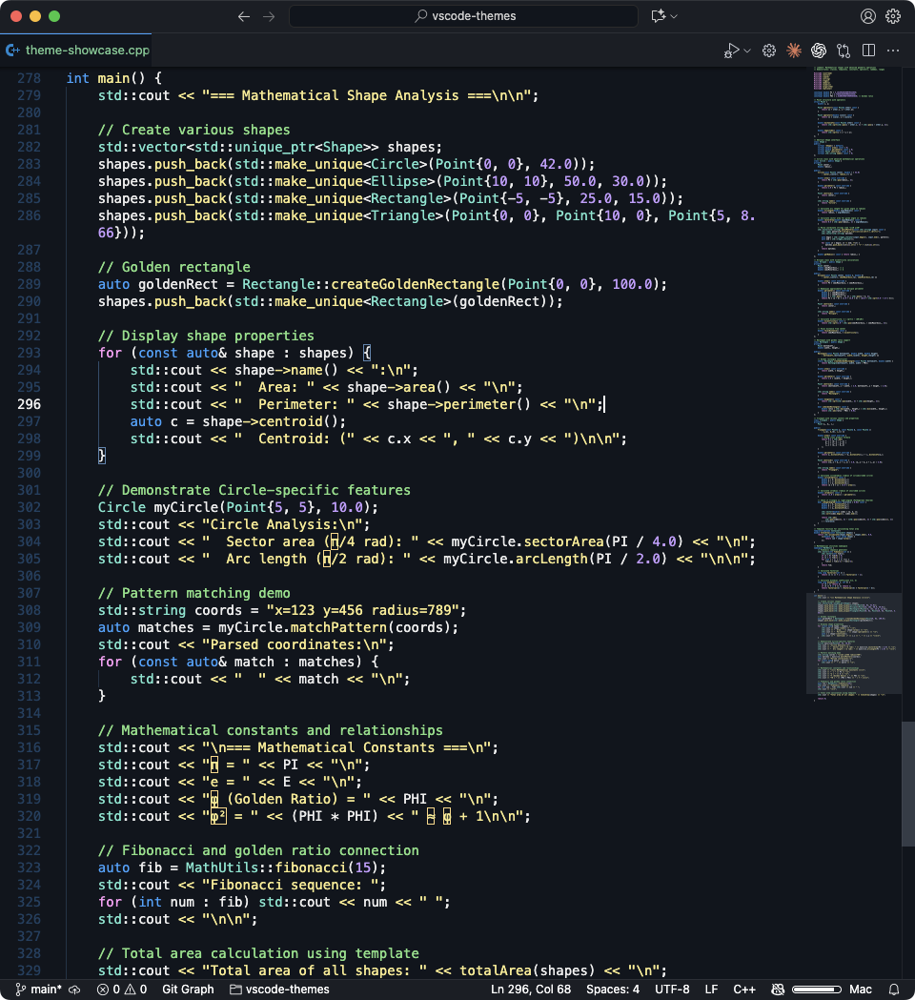
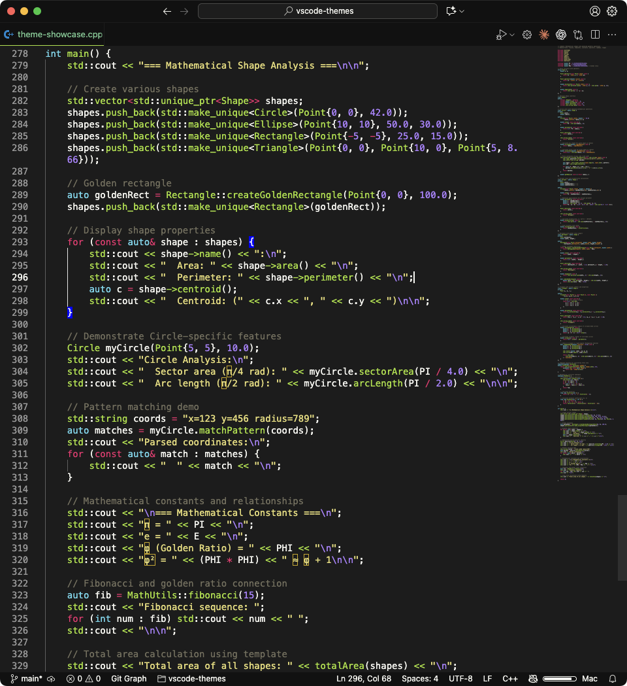

# Selecta Mea – VS Code Themes Collection

> _Latin: selecta mea — “my selections”._

A collection of 8 professionally and passionately designed themes with dark and light variants.

## Code Snippets

### Iceberg Theme (Light)

### ChatGPT Theme (Light)

### Light Modern (Plus)

### Monokai Solarized Light — Polished 

### ChatGPT Theme (Dark)

### Darcula

### Iceberg Theme (Dark)

### Monokai Space Gray — Polished

## Themes

### Dark (5)
- ChatGPT Theme (Dark)
- Iceberg Theme (Dark)
- Darcula
- Monokai Space Gray — Polished
- Monokai Solarized Light — Polished

### Light (3)
- ChatGPT Theme (Light)
- Iceberg Theme (Light)
- Light Modern (Plus)

## Features

- High contrast and readability
- Semantic highlighting support
- Terminal styling included
- Git diff colors optimized

## Installation

1. Download `selecta-mea-themes-1.0.0.vsix`
2. Open VS Code
3. Press `Cmd+Shift+P` or `Ctrl+Shift+P`
4. Type "Install from VSIX"
5. Select the downloaded file and reload

## Distribution

Distributed as a pre-compiled VSIX package.

## License

MIT License - Free to use, modify, and distribute. See LICENSE file for details.

---

Version 1.0.0 (Fall 2025)
