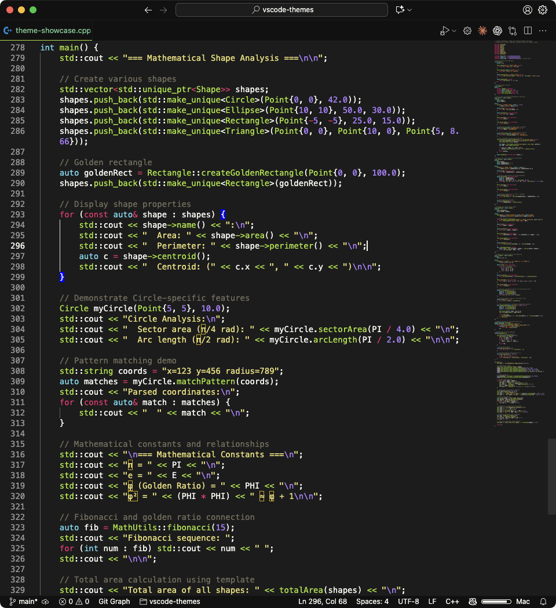

# Selecta Mea Themes

8 professionally designed VS Code themes with dark and light variants.

## Themes

### ChatGPT Theme (Dark)
Black background with signature green accents.

### ChatGPT Theme (Light)
Clean white background with green accents.

### Iceberg Theme (Dark)
Cool blue-black background with muted syntax colors.

### Iceberg Theme (Light)
Soft gray-blue with high contrast.

### Darcula
Ultra-dark theme with vibrant syntax highlighting.

### Monokai Space Gray — Polished
Classic Monokai color palette with modern UI.

### Monokai Solarized Light — Polished
Scientific Solarized palette for light environments.

### Light Modern (Plus)
Enhanced VS Code Light Modern with improved contrast.

## Installation

1. Download `selecta-mea-themes-x.x.x.vsix`
2. Open VS Code
3. Press `Cmd+Shift+P` or `Ctrl+Shift+P`
4. Type "Install from VSIX"
5. Select the file and reload

Select theme: `Cmd+K Cmd+T` or `Preferences > Color Theme`

## Features

- 8 themes (5 dark, 3 light)
- High contrast and readability
- Semantic highlighting support
- Terminal styling included
- Git diff colors optimized

## License

MIT License - Extension usage permitted. Theme color schemes are proprietary.

Version 1.0.0
